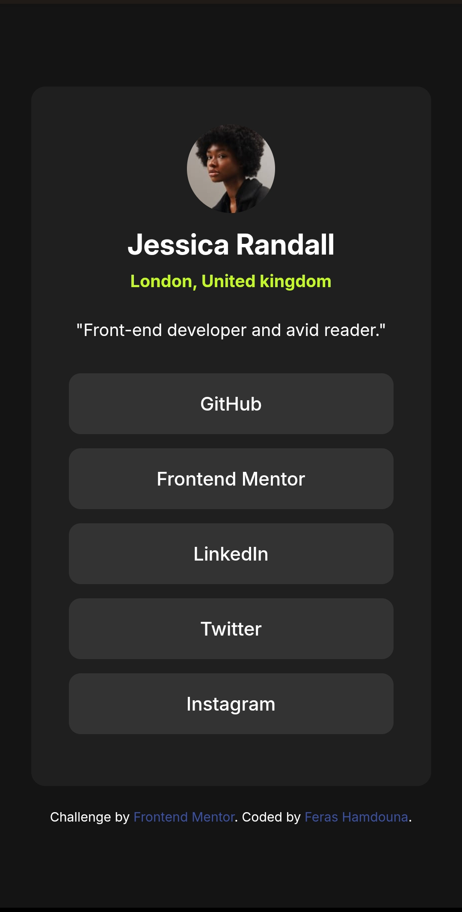
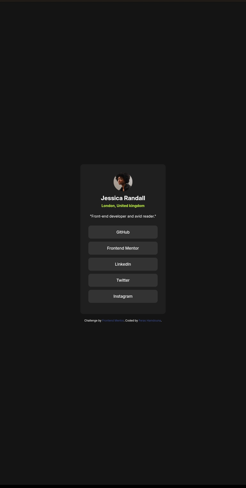
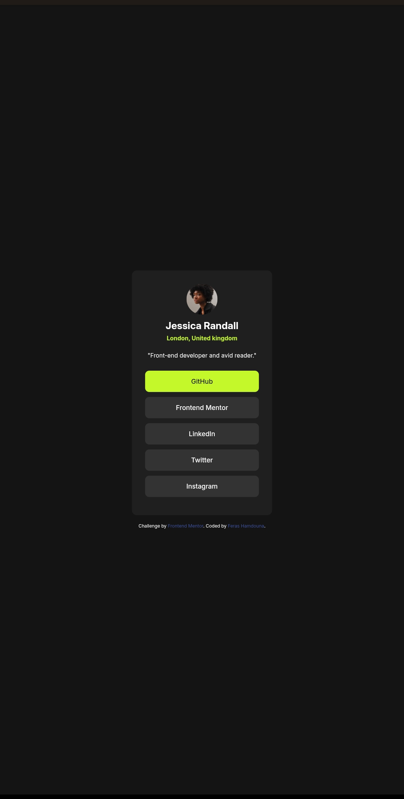

# Social Links Profile Solution

This is a solution to the [Social Links Profile challenge on Frontend Mentor](https://www.frontendmentor.io/challenges/social-links-profile-UG32l9m6dQ).

## Table of contents

- [Overview](#overview)
  - [The challenge](#the-challenge)
  - [Screenshot](#screenshot)
  - [Links](#links)
- [My process](#my-process)
  - [Built with](#built-with)
- [Author](#author)

## Overview

### The challenge

Users should be able to:

- View the optimal layout depending on their device's screen size.
- See hover states for interactive elements.
- Access social media links easily.

### Screenshot

    
    
  

### Links

- Solution URL: [View the solution on Frontend Mentor](https://www.frontendmentor.io/solutions/responsive-social-links-profile-using-html-css-and-flexbox-aBJS3eaix5)
- Live Site URL: [View Live Site](https://ferashamdouna.github.io/social-links-profile/)

## My process

### Built with

- Semantic HTML5
- CSS custom properties
- Flexbox
- Responsive design
- Mobile-first workflow

## Author

- GitHub - [@FerasHamdouna](https://github.com/FerasHamdouna)
- Frontend Mentor - [@FerasHamdouna](https://www.frontendmentor.io/profile/FerasHamdouna)
